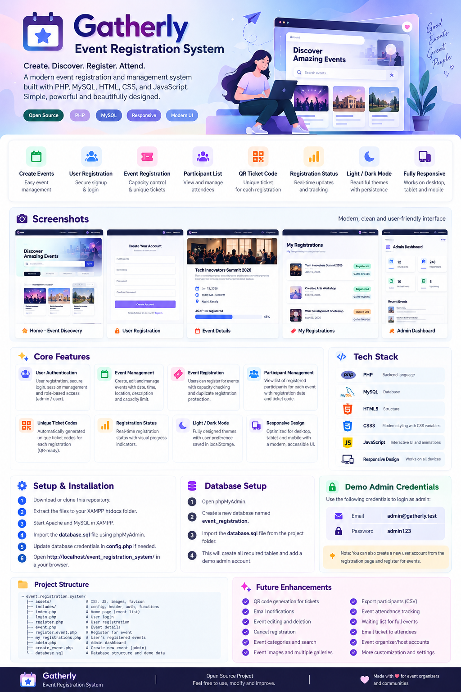

<div align="center">

# ✦ Gatherly

### Modern Event Registration & Management System

Create. Discover. Register. Attend.

[](https://www.php.net/)
[](https://www.mysql.com/)
[](https://developer.mozilla.org/en-US/docs/Web/JavaScript)
[](#-features)

</div>

<p align="center">
  
</p>

<p align="center">
  <strong>A polished, responsive event platform built with plain PHP, MySQL, HTML, CSS and JavaScript.</strong><br>
  Designed for communities, meetups, workshops, conferences and small event teams.
</p>

---

## ✨ What is Gatherly?

Gatherly is a full-stack **event registration system** where administrators can create and manage events while users can discover events, create accounts, register for events and view their registrations.

The interface is designed to feel like a real SaaS product rather than a generic PHP CRUD application — with a branded visual system, responsive layouts, purposeful animations, theme persistence, registration feedback and clean admin tooling.

---

## 🚀 Features

| Area | Features |
|---|---|
| 👤 **User Authentication** | User registration, login, logout, secure password hashing and role-based access |
| 📅 **Event Management** | Admin event creation, event details, date/time, location and capacity |
| 🎟️ **Event Registration** | One-click registration, capacity validation and duplicate-registration protection |
| 👥 **Participant Management** | Admin participant list with names, email, ticket codes and registration status |
| 🔐 **Admin Dashboard** | Event statistics, registration counts, attendee counts and event management |
| 🎫 **Ticket Codes** | Unique server-generated ticket code for every confirmed registration |
| 📊 **Registration Status** | Confirmed, cancelled and attended-ready status model |
| 🌓 **Light / Dark Mode** | Purpose-designed themes with `localStorage` persistence |
| 📱 **Responsive UI** | Desktop, tablet and mobile layouts |
| ✨ **Micro-interactions** | Hover elevation, button feedback, focus states, toast notifications and reveals |
| ♿ **Accessibility** | Semantic controls, readable contrast, keyboard-friendly forms and reduced-motion support |
| 🪄 **Custom Branding** | Gatherly favicon, logo treatment, custom components and event-focused visual language |

---

## 🖥️ Application Flow

```text
                         ┌──────────────────┐
                         │     Gatherly     │
                         │   Event Portal   │
                         └────────┬─────────┘
                                  │
                    ┌─────────────┴─────────────┐
                    ▼                           ▼
             ┌──────────────┐             ┌──────────────┐
             │    Visitor   │             │    Admin     │
             └──────┬───────┘             └──────┬───────┘
                    │                            │
          ┌─────────┴─────────┐          ┌───────┴────────┐
          ▼                   ▼          ▼                ▼
      Discover            Sign Up     Dashboard      Create Event
          │                   │          │                │
          └─────────┬─────────┘          └───────┬────────┘
                    ▼                            ▼
             Event Details                  Public Event
                    │
                    ▼
              Register Event
                    │
                    ▼
              Ticket Code
                    │
                    ▼
            My Registrations
```

---

## 🎨 Interface Highlights

### Event discovery
- Strong event-focused hero section
- Upcoming event cards
- Date blocks and registration progress
- Open / Full states
- Location and event metadata
- Clear calls to action

### Event details
- Large event header
- Date and location information
- Live capacity indicator
- Registration panel
- Already-registered state
- Login/signup redirect flow

### User experience
- Dedicated account creation page
- Automatic login after successful signup
- Registration confirmation toast
- Personal **My Registrations** page
- Ticket code visibility

### Admin experience
- KPI dashboard
- Event management table
- Registration counts
- Capacity progress
- Participant management
- Event creation workflow

---

## 🧰 Tech Stack

```text
Frontend
├── HTML5
├── CSS3
│   ├── CSS Variables
│   ├── Responsive Grid / Flexbox
│   ├── Keyframe Animations
│   └── Light / Dark Design Tokens
└── Vanilla JavaScript
    ├── Theme persistence
    ├── Mobile navigation
    ├── Form validation
    └── Toast behaviour

Backend
├── PHP 8+
├── PDO
├── Sessions
├── password_hash / password_verify
└── Prepared SQL statements

Database
└── MySQL / MariaDB
```

---

## 📁 Project Structure

```text
Gatherly/
│
├── assets/
│   ├── css/
│   │   └── style.css
│   ├── js/
│   │   └── app.js
│   └── favicon.svg
│
├── config.php
├── auth.php
├── header.php
├── footer.php
│
├── index.php                 # Event discovery
├── event.php                 # Event details
├── login.php                 # User/admin login
├── register.php              # User registration
├── logout.php                # Logout
├── register_event.php        # Event registration handler
├── my_registrations.php      # User registrations
│
├── admin.php                 # Admin dashboard
├── create_event.php          # Create event
├── participants.php          # Participant list
│
├── database.sql              # Database schema + demo data
└── README.md
```

---

## ⚡ Quick Start

### 1. Clone the repository

```bash
git clone https://github.com/YOUR_USERNAME/gatherly-event-registration-system.git
cd gatherly-event-registration-system
```

### 2. Run with XAMPP

Copy the project into:

```text
C:\xampp\htdocs\gatherly-event-registration-system
```

Start:

```text
Apache ✓
MySQL  ✓
```

### 3. Create the database

Open **phpMyAdmin** and import:

```text
 database.sql
```

The SQL creates:

- `users`
- `events`
- `registrations`

and inserts demo event data plus an admin account.

### 4. Configure MySQL

Open `config.php` and update the credentials if necessary:

```php
$host = 'localhost';
$db   = 'event_registration';
$user = 'root';
$pass = '';
```

### 5. Open Gatherly

```text
http://localhost/gatherly-event-registration-system/
```

---

## 🔑 Demo Admin

Use the following account for the admin dashboard:

```text
Email:    admin@gatherly.test
Password: admin123
```

After login:

```text
Admin → Create event
Admin → View participants
Admin → Manage events
```

> ⚠️ Change or remove demo credentials before deploying publicly.

---

## 👤 User Registration

New visitors can create an account from the **Create account** page.

The registration flow validates:

- Name
- Email format
- Password length
- Password confirmation
- Duplicate email addresses

Passwords are stored using PHP's password hashing API rather than plain text.

After signup:

```text
Create account
      ↓
Account created
      ↓
Automatically logged in
      ↓
Browse events
      ↓
Register for an event
```

---

## 🎟️ Event Registration

When a user selects an event, Gatherly checks:

1. The event exists.
2. Registration capacity has not been reached.
3. The user has not already registered.
4. The registration is inserted into MySQL.
5. A unique ticket code is generated.

Example:

```text
GTH-A82F31C9
```

The database transaction also protects the capacity check against conflicting registrations.

---

## 🗃️ Database Model

```text
┌─────────────────┐          ┌─────────────────┐
│     users       │          │     events      │
├─────────────────┤          ├─────────────────┤
│ id PK           │          │ id PK           │
│ name            │          │ title           │
│ email UNIQUE    │          │ description     │
│ password        │          │ event_date      │
│ role            │          │ location        │
│ created_at      │          │ capacity        │
└────────┬────────┘          │ created_at      │
         │                   └────────┬────────┘
         │                            │
         │         ┌──────────────────┘
         │         │
         ▼         ▼
       ┌──────────────────────┐
       │    registrations     │
       ├──────────────────────┤
       │ id PK                │
       │ event_id FK          │
       │ user_id FK           │
       │ registered_at        │
       │ ticket_code UNIQUE   │
       │ status               │
       └──────────────────────┘
```

---

## 🌓 Theme System

Gatherly has intentionally designed Light and Dark themes instead of simply applying an inverted color filter.

The design system defines separate variables for:

```css
--bg
--surface
--surface-2
--text
--muted
--border
--accent
--accent-strong
--accent-soft
--success
--warning
--error
--shadow
```

The selected theme is persisted with:

```javascript
localStorage.setItem('gatherly-theme', theme);
```

Users can clearly see the current state through:

```text
☀ Light Mode
☾ Dark Mode
```

---

## ✨ Animation & Interaction System

Animations are intentionally subtle and functional.

- Card hover elevation
- Button press feedback
- Focus ring transitions
- Page reveal animation
- Toast entrance / exit
- Mobile navigation transition
- Progress indicators
- Interactive theme toggle
- Form validation feedback
- Reduced-motion fallback

For users who prefer less motion:

```css
@media (prefers-reduced-motion: reduce) {
    /* animations are minimized */
}
```

---

## 🔐 Security Foundations

The MVP uses several basic security practices:

- PDO prepared statements
- Password hashing with `password_hash()`
- Password verification with `password_verify()`
- Session-based authentication
- Role checks for admin pages
- Unique database constraints
- Server-side capacity validation
- Server-side duplicate registration protection
- Cryptographically generated ticket codes

### Production hardening still recommended

Before deploying publicly, add:

- CSRF protection
- HTTPS
- Rate limiting
- Email verification
- Password reset
- Stronger session configuration
- Audit logging
- More granular authorization
- Input/content sanitization policies

---

## 🛣️ Roadmap

### Planned enhancements

- [ ] QR code generation for tickets
- [ ] QR ticket scanning / attendance check-in
- [ ] Event editing
- [ ] Event deletion
- [ ] Registration cancellation
- [ ] Email confirmations
- [ ] Email ticket delivery
- [ ] Event search and filtering
- [ ] Event categories
- [ ] Event cover images
- [ ] CSV participant export
- [ ] Waiting list for full events
- [ ] Attendance tracking
- [ ] Organizer profiles
- [ ] Multiple admin/organizer accounts
- [ ] Password reset
- [ ] Email verification
- [ ] Analytics dashboard

---

## 🌟 Why Gatherly?

Gatherly is intentionally kept simple at its foundation while giving the application a polished product experience.

It is suitable as:

- 🎓 A college / MCA project
- 💼 A portfolio project
- 🧪 A PHP + MySQL learning project
- 🏫 A college event platform
- 👥 A meetup registration system
- 🎤 A workshop registration platform
- 🏢 A small organization's internal event tool

---

## 🤝 Contributing

Contributions and improvements are welcome.

```bash
git checkout -b feature/my-improvement
git add .
git commit -m "Add my improvement"
git push origin feature/my-improvement
```

Then open a pull request.

---

## 📜 License

This project is intended as an open-source portfolio / learning project. Add the license that best matches how you want to distribute your repository.

---

<div align="center">

### ✦ Gatherly

**Create. Discover. Register. Attend.**

Made for event organizers, communities and people who love bringing others together.

</div>
